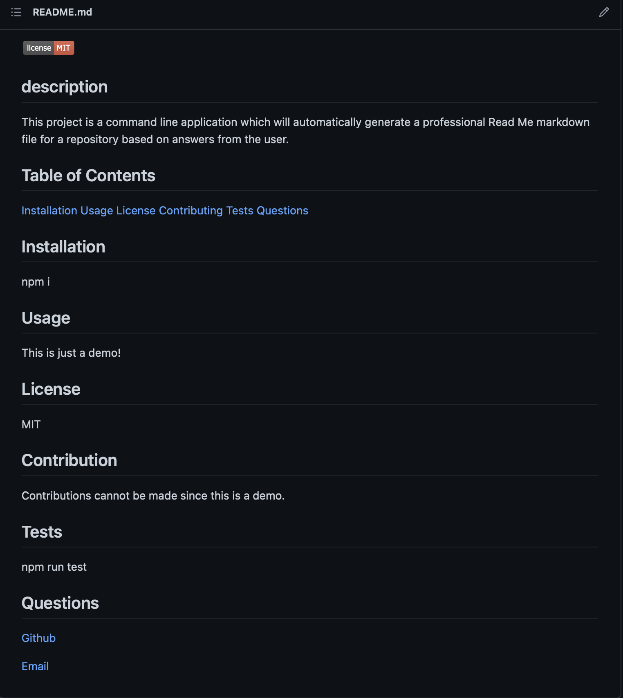
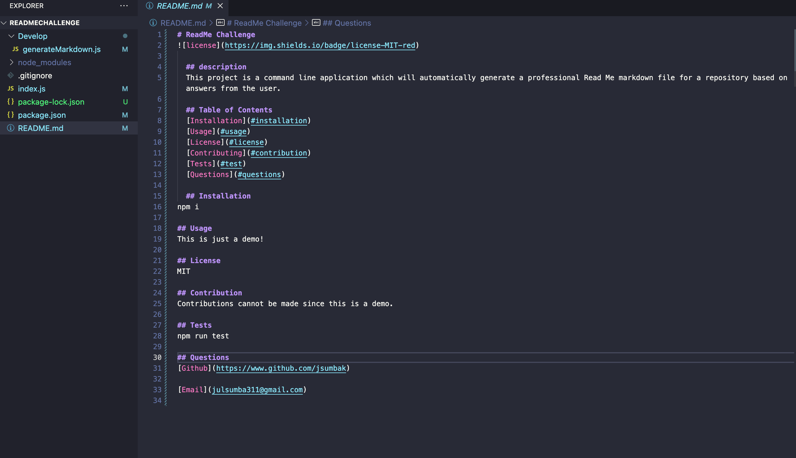

# ReadMe Challenge

  ## description
  This project is a command line application which will automatically generate a professional Read Me markdown file for a repository based on answers from the user.

  Link to video: [https://drive.google.com/file/d/1XnPCbpYScYNFY2iGxvEJt8En8o35LvMh/view]

  ## Table of Contents
  [Installation](#installation) 
  [Usage](#usage)
  [License](#license)
  [Contributing](#contribution)
  [Tests](#test)
  [Questions](#questions)

  ## Installation
npm i

## Usage
This is just a demo!

## License
MIT

## Contribution
Contributions cannot be made since this is a demo.

## Tests
npm run test

## Questions
[Github](https://www.github.com/jsumbak)

[Email](julsumba311@gmail.com)

 
 
 